<p align="center">
  
</p>

<p align="center">
  <a href="https://github.com/CogitoAgency/SwiftAware/actions/workflows/ci.yml"></a>
  
  
  
  
  
</p>

SwiftAware adds an invisible observation layer — **ghost UI** — to your SwiftUI app. AI assistants like Claude can see your view hierarchy, track state changes, dispatch actions, and run test plans, all without touching the visible interface. The user sees nothing. The LLM sees everything.

## Installation

Add to your `Package.swift`:

```swift
dependencies: [
    .package(url: "https://github.com/CogitoAgency/SwiftAware.git", from: "1.0.0")
],
targets: [
    .target(name: "YourApp", dependencies: ["SwiftAware"])
]
```

Or in Xcode: **File > Add Package Dependencies** and paste the repo URL.

**Requirements:** Swift 6.0+ / iOS 17+ / macOS 14+ / watchOS 10+ / tvOS 17+

---

## Ghost UI

The ghost layer instruments your views without any visible side effects.

### `.ghostID()` — Register views for LLM visibility

```swift
import SwiftAware

struct ContentView: View {
    var body: some View {
        VStack {
            Text("Hello").ghostID("greeting")
            Button("Save") { save() }
                .ghostID("save-button")
        }
        .trackLifecycle("ContentView")
    }
}
```

An LLM can now check `Aware.dispatcher.isViewVisible("greeting")` and dispatch `.tap(id: "save-button")`.

### `@TrackedState` — Observable state property wrapper

```swift
struct SettingsView: View {
    @TrackedState("selectedTab") var selectedTab: Tab = .general

    var body: some View {
        TabView(selection: $selectedTab) {
            GeneralTab().tag(Tab.general)
            AdvancedTab().tag(Tab.advanced)
        }
    }
}
```

Every change is logged and queryable: `Aware.dispatcher.getState("selectedTab")`.

### `.ghostTrackState()` — Track any computed value

```swift
Text("Score: \(score)")
    .ghostTrackState("score", value: "\(score)")
```

### `TrackedButton` — Tap logging

```swift
TrackedButton("Save", in: "SettingsView") {
    saveSettings()
} label: {
    Label("Save", systemImage: "checkmark")
}
```

### `.trackLifecycle()` — View appear/disappear monitoring

```swift
MyView()
    .trackLifecycle("MyView", properties: ["screen": "settings"])
```

Logs appear/disappear events with duration in milliseconds.

### `.trackTap()` — Add tap tracking to any view

```swift
Image(systemName: "gear")
    .trackTap("open-settings") { showSettings() }
```

---

## Action Dispatch

`UIActionDispatcher` lets LLMs programmatically interact with the ghost layer.

```swift
let dispatcher = Aware.dispatcher

// Dispatch UI actions
await dispatcher.dispatch(.tap(id: "save-button"))
await dispatcher.dispatch(.type(id: "search-field", text: "query"))
await dispatcher.dispatch(.swipe(id: "card", direction: .left))
await dispatcher.dispatch(.selectTab(name: "Settings"))
await dispatcher.dispatch(.wait(seconds: 1.0))

// Assertions
await dispatcher.dispatch(.expectVisible(id: "results-list"))
await dispatcher.dispatch(.expectHidden(id: "loading-spinner"))
await dispatcher.dispatch(.expectState(key: "selectedTab", value: "settings"))

// Wait for views
await dispatcher.waitForView("results-list", timeout: 5.0)
await dispatcher.waitForState("status", equals: "loaded", timeout: 3.0)

// Query state
dispatcher.isViewVisible("greeting")       // Bool
dispatcher.getState("selectedTab")          // String?
dispatcher.visibleViews                     // Set<String>
dispatcher.state                            // [String: String]
```

### Plan vs Actual Reports

```swift
dispatcher.clearLog()

// ... run a sequence of actions ...

print(dispatcher.getPlanVsActualReport())
```

Output:

```
═══════════ PLAN VS ACTUAL ═══════════
▶ PLAN: Tap 'save-button'
  ACTUAL: ✅ 0.12s
  📱 View appeared: confirmation-dialog
▶ PLAN: Expect 'confirmation-dialog' visible
  ACTUAL: ✅ 0.00s
═══════════════════════════════════════
```

### Register Custom Handlers

```swift
dispatcher.registerHandler(for: "save-button") { action in
    await performSave()
    return true
}

dispatcher.registerCustomAction("clearCache") {
    CacheManager.shared.clear()
}
```

---

## Structured Logging

Actor-based logger with levels, categories, metadata, and emoji support.

```swift
Aware.logger.trace("Cache lookup", metadata: ["key": cacheKey])
Aware.logger.debug("Parsed response", metadata: ["items": "\(items.count)"])
Aware.logger.info("User logged in", metadata: ["userId": "123"])
Aware.logger.warn("Retrying request", metadata: ["attempt": "2"])
Aware.logger.error("Network failed", metadata: ["error": error.localizedDescription])
```

**Levels:** `trace` > `debug` > `info` > `warn` > `error` — configurable minimum via `.swiftaware.json`.

Logs are forwarded to both `os.log` and the SwiftAware log collector for aggregation and export.

---

## Auto-Log Macros

Compile-time macros that inject entry, exit, and error logging into functions.

### `@AutoLog` — Single function

```swift
@AutoLog(verbosity: .verbose, category: "Network")
func fetchUser(id: Int) async throws -> User {
    let response = try await api.get("/users/\(id)")
    return try decode(response)
}
// Logs: [ENTER] fetchUser(42)
// Logs: [EXIT] fetchUser -> User (0.234s)
// Or:   [ERROR] fetchUser: NetworkError.timeout (0.234s)
```

### `@AutoLogAll` — All methods in a type

```swift
@AutoLogAll(category: "UserService")
class UserService {
    func fetchUser(id: Int) async throws -> User { ... }
    func updateUser(_ user: User) async throws { ... }

    @NoLog
    func internalHelper() { ... }  // excluded
}
```

**Verbosity levels:** `.minimal` (timing only), `.standard` (entry/exit), `.verbose` (includes parameter values).

---

## Test Runner

Tiered test execution with presets and build-change detection.

### Presets

| Preset | Tiers | Parallel | Stop on Failure | Retries |
|--------|-------|----------|-----------------|---------|
| `.minimal` | smoke | No | Yes | 0 |
| `.ci` | smoke, structure | Yes | Yes | 2 |
| `.verbose` | smoke, structure, integration | No | No | 3 |

### Run on Launch

```swift
@main
struct MyApp: App {
    init() {
        #if DEBUG
        Task { await Aware.runOnLaunchIfNeeded() }
        #endif
    }

    var body: some Scene {
        WindowGroup { ContentView() }
    }
}
```

Only re-runs when the build number changes.

### Custom Test Cases

```swift
class SmokeTests: AwareTestCase {
    var tier: TestTier { .smoke }

    func runTest() async throws {
        try assert(AppState.shared.isReady, "App not ready")
        try assertEqual(AppState.shared.screens.count, 5)
    }
}

// Register and run
let runner = await Aware.getTestRunner()
await runner.register(SmokeTests())
let result = await Aware.run(preset: .minimal)
```

### Test Plans (Plan vs Actual)

```swift
let plan = TestPlan(name: "Login Flow") {
    TestStep("Show login screen") {
        await dispatcher.dispatch(.expectVisible(id: "login-view"))
    }
    TestStep("Enter credentials") {
        await dispatcher.dispatch(.type(id: "email", text: "user@example.com"))
        await dispatcher.dispatch(.type(id: "password", text: "secret"))
    }
    TestStep("Submit") {
        await dispatcher.dispatch(.tap(id: "login-button"))
        await dispatcher.dispatch(.waitForView(id: "home-view", timeout: 5))
    }
}

let result = await Aware.runPlan(plan)
```

---

## MCP Server

Built-in [Model Context Protocol](https://modelcontextprotocol.io) server for direct AI assistant integration. Register tools that expose your app's ghost UI to LLMs over stdio, HTTP, or WebSocket.

```swift
let server = MCPServer(name: "MyApp", version: "1.0")

await server.registerTool(ViewQueryTool())
await server.registerTool(ActionDispatchTool())

try await server.start(transport: .stdio)
```

### Custom MCP Tools

```swift
struct ViewQueryTool: MCPTool {
    let name = "queryViews"
    let description = "List all visible ghost UI views"
    let inputSchema: MCPToolSchema = .empty

    func execute(arguments: [String: MCPValue]?) async throws -> MCPToolCallResult {
        let views = await Aware.dispatcher.visibleViews
        return .text(views.sorted().joined(separator: "\n"))
    }
}
```

---

## Design Tokens

`AwareTheme` provides centralized design constants for consistent iOS UI.

```swift
// Colors (SwiftUI)
AwareTheme.Colors.primary       // Color.blue
AwareTheme.Colors.success       // Color.green
AwareTheme.Colors.background    // system background (iOS/macOS adaptive)

// Spacing (4pt base)
AwareTheme.Spacing.xs   // 4pt
AwareTheme.Spacing.sm   // 8pt
AwareTheme.Spacing.md   // 16pt
AwareTheme.Spacing.lg   // 24pt

// Typography
AwareTheme.Typography.body      // 13pt
AwareTheme.Typography.title     // 17pt
AwareTheme.Typography.headline  // 24pt

// Corner radius, animation durations, shadows also available
```

---

## Feature Flags

Typed feature flag registry with environment variable fallback.

```swift
let flags = FeatureFlagRegistry.shared

// Query
if await flags.isEnabled("cook_enabled") { ... }
let timeout = flags.getDouble("agent_timeout_seconds", default: 300.0)

// Register
await flags.register("my_feature", enabled: true)
await flags.register("max_items", value: 50)

// Toggle at runtime
await flags.toggle("debug_mode")

// Environment variable override: AWARE_FLAG_MY_FEATURE=true
```

**Built-in flags:** `AwareFeatureFlag.debugMode`, `.cookEnabled`, `.swarmEnabled`, `.proUser`, `.cloudSync`, and more.

---

## Configuration

Create `.swiftaware.json` in your project root or app bundle:

```json
{
  "version": "1.0",
  "project": {
    "name": "MyApp",
    "platform": "swift",
    "buildNumber": "42"
  },
  "logging": {
    "level": "debug",
    "format": "pretty",
    "includeEmoji": true,
    "includeTimestamps": true
  },
  "testing": {
    "runOnLaunch": true,
    "runOnBuildChange": true,
    "tiers": ["smoke", "structure"],
    "parallel": false,
    "retries": 2,
    "timeout": {
      "smoke": 3,
      "structure": 30,
      "integration": 120
    }
  }
}
```

Or initialize programmatically:

```swift
Aware.initialize(configPath: "/path/to/.swiftaware.json")
```

---

## Architecture

```
Sources/
  SwiftAware/
    SwiftUI/              Ghost UI — ghostID, ghostTrackState, TrackedState,
                          TrackedButton, UIActionDispatcher, ViewLifecycleTracker
    Logging/              Structured logging — Logger, LogCollector, AwareLogLevel
    Testing/              Test runner — AwareTestCase, TestPlan, TestRunner, presets
    Standards/            Design tokens — AwareTheme, AwareFeatureFlags, AwareStrings
    MCP/                  Model Context Protocol — MCPServer, MCPTool, transports
    Cook/                 Multi-agent orchestration — CookAgent, CookTask, blocking
    Config/               Configuration — AwareConfig, ConfigLoader, Preset
    Storage/              Persistence — MemoryStorage, SQLiteStorage
    Integration/          External bridges — BreatheIntegration
  SwiftAwareMacros/       Macro declarations — @AutoLog, @AutoLogAll, @NoLog
  SwiftAwareMacrosPlugin/ Compiler plugin — AutoLogMacro, CodeGenerator
```

## License

MIT
